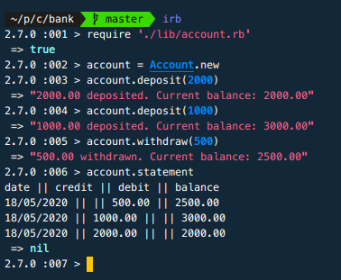

<!-- omit in toc -->
# Bank - Ruby

This is a small project to practice maintaining code quality and process. [Source]

I have created a JavaScript implementation for the [browser](https://github.com/hturnbull93/bank-js/), and in [node](https://github.com/hturnbull93/bank-node/).
I have also made a Python implementation, [available here](https://github.com/hturnbull93/bank-py/).

It allows you to create an account, deposit funds into it, withdraw funds from it, and print statements.

- [Spec](#spec)
  - [Requirements](#requirements)
  - [Acceptance criteria](#acceptance-criteria)
- [Quick Start](#quick-start)
- [Screen Preview](#screen-preview)
- [Gems](#gems)
  - [Rubocop Configuration](#rubocop-configuration)
- [Development Journal](#development-journal)
  - [Domain Modelling](#domain-modelling)
  - [User Stories](#user-stories)
  - [Set up](#set-up)
  - [Accounts](#accounts)
  - [Deposits](#deposits)
  - [Withdrawals](#withdrawals)
  - [Statement](#statement)
  - [Transactions](#transactions)
  - [Back to Account Statement](#back-to-account-statement)
  - [Simplecov and Rubocop](#simplecov-and-rubocop)
  - [Pretty Deposit & Withdraw Returns](#pretty-deposit--withdraw-returns)
  - [Pretty Print Statement](#pretty-print-statement)
  - [Extracting a Printer Class](#extracting-a-printer-class)
  - [Refactoring To Use Pence](#refactoring-to-use-pence)

## Spec

### Requirements

- You should be able to interact with your code via a REPL like IRB or the JavaScript console. (You don't need to implement a command line interface that takes input from STDIN.)
- Deposits, withdrawal.
- Account statement (date, amount, balance) printing.
- Data can be kept in memory (it doesn't need to be stored to a database or anything).

### Acceptance criteria

**Given** a client makes a deposit of 1000 on 10-01-2012  
**And** a deposit of 2000 on 13-01-2012  
**And** a withdrawal of 500 on 14-01-2012  
**When** she prints her bank statement  
**Then** she would see:

```irb
date || credit || debit || balance
14/01/2012 || || 500.00 || 2500.00
13/01/2012 || 2000.00 || || 3000.00
10/01/2012 || 1000.00 || || 1000.00
```

## Quick Start

1. Clone this repo.
2. Install dependencies with:

   ```shell
   bundle
   ```

3. Run test suites with:

   ```shell
   rspec && rubocop
   ```

4. Launch IRB:

   ```shell
   irb
   ```

   Once in IRB.

   ```irb
   require './lib/account.rb'
   account = Account.new
   ```

5. Use your account with the following methods

| Method                     | Description                                      |
| -------------------------- | ------------------------------------------------ |
| `account.deposit(number)`  | deposit however much you want into your account, this figure is in pounds with pence as decimals.  |
| `account.withdraw(number)` | withdraw however much you want from your account, this figure is in pounds with pence as decimals. |
| `account.statement`        | prints a statement of all transactions so far    |

You should see something similar to the below in your terminal:

## Screen Preview



## Gems

This project has no production dependencies.

Testing and Development gems are:

| Gem               | Description                                       |
| ----------------- | ------------------------------------------------- |
| rspec             | Testing framework                                 |
| rubocop           | Linter, checks for code quality and conventions   |
| simplecov         | Measures test coverage                            |
| simplecov-console | Displays measured test coverage when rspec is run |

### Rubocop Configuration

Rubocop config is specified in `.rubocop.yml`.

Configured to ignore any file in the `spec` directory, and the `Gemfile`.

I have also disabled to documentation ruleset, to prevent it applying the `Missing top-level class documentation comment` rule (which for this small project is a bit overkill).

## Development Journal

### Domain Modelling

CRC modelling:


### User Stories

- [x] 1

> As a Bank Manager,  
> So that we only take customers money,  
> I want accounts to start with balance 0

- [x] 2

> As a Customer,  
> So I can keep my money safe,  
> I want to be able to deposit into my account

- [x] 3

> As a Customer,  
> So I can spend my money,  
> I want to be able to withdraw from my account

- [x] 3.1

> As a Bank Manager,  
> So we don't go out of pocket,  
> I want withdrawals to only be allowed to occur if the customer has sufficient funds

- [x] 4

> As a Customer,  
> So I can keep on top of my finances,  
> I want to be able to print my account statement

- [x] 4.1

> As a Customer,  
> So I know when each transaction happened,  
> I want transactions on my statement to have the date

- [x] 4.2

> As a Customer,  
> So I know how much each deposit was,  
> I want deposits on my statement to have the credit amount.

- [x] 4.3

> As a Customer,  
> So I know how much each withdrawal was,  
> I want withdrawals on my statement to have the debit amount.

- [x] 4.4

> As a Customer,  
> So can keep track of my balance,  
> I want transactions on my statement to have the balance amount after the transaction was completed.

- [x] 4.5

> As a Customer,  
> Because more recent transactions are more important to me,  
> I want the statement transactions to be ordered from newest to oldest.

### Set up

Initialised with Bundler, and added RSpec to the Gemfile in test/dev groups, then bundled to install.

Initialised RSpec.

### Accounts

- [x] 1

> As a Bank Manager,  
> So that we only take customers money,  
> I want accounts to start with balance 0

In `spec/account_spec.rb` wrote a test for an Account class that is initialised with a balance of 0. Red.

In `lib/account.rb`:

- Added class Account with `initialize` method setting balance attribute with 0, exposed as readable.

### Deposits

- [x] 2

> As a Customer,  
> So I can keep my money safe,  
> I want to be able to deposit into my account

Test for Account for a `deposit` method taking 100 results in a balance of 100. Red.

- Added `deposit` method with amount as param, sets balance to 100 hardcoded.

Green.

Test for Account for a `deposit` method taking 200 results in a balance of 200. Red.

- `deposit` method sets balance to the amount passed.

Green.

Test for Account for two deposits, one of 100 and another of 300, results in balance of 400.

- `deposit` method uses `+=` instead of just assigning `@balance` with `amount`

### Withdrawals

- [x] 3

> As a Customer,  
> So I can spend my money,  
> I want to be able to withdraw from my account

Test for Account for a `withdraw` method. In the describe block added a `before` block to deposit 1000, so there is something to withdraw.

Test for withdraw 100 results in a balance of 900. Red.

- Added `withdraw` method taking amount as param, sets `@balance` to 900 hardcoded.

Test for withdraw 200 results in balance of 800. Red.

- `withdraw` now sets `@balance` as `@balance` less the withdrawn amount with the `-=` operator.

Green.

- [x] 3.1

> As a Bank Manager,  
> So we don't go out of pocket,  
> I want withdrawals to only be allowed to occur if the customer has sufficient funds

Test for withdraw 1500 results in error: Insufficient funds.

- within `withdraw`, if `@balance` is less than amount raise 'Insufficient funds'

Green.

Refactored to guard clause from if block.

_Later refactored to simply return a string 'Insufficient funds', rather than raising a runtime error._

### Statement

- [x] 4

> As a Customer,  
> So I can keep on top of my finances,  
> I want to be able to print my account statement

In `spec/account_feature_spec.rb` wrote a feature test based on the above acceptance criteria. Red.

- Added `statement` method to account.
- Hardcoded the response based on the expected statement.

Green.

Wrote another feature test with different figures. Red.

For this I think I should implement the Transaction class.

### Transactions

- [x] 4.1

> As a Customer,  
> So I know when each transaction happened,  
> I want transactions on my statement to have the date

In `spec/transaction_spec.rb` added a test for Transaction class, it's display method returns a string in the format of a transaction row on a statement, with the time in the first column. Red.

In `lib/transaction.rb`:

- Transaction class initialised with time as `Time.now`.
- `formatTime` private helper method formats the time as the required "dd/mm/yyyy" string.
- `display` method returns the `formatTime` result into a string with columns as per the statement transaction row.

Green.

- [x] 4.2

> As a Customer,  
> So I know how much each deposit was,  
> I want deposits on my statement to have the credit amount.

Test for display method to return a string in the format of a transaction row on a statement, with the time in the first column, and credit in second column when initialised with a credit keyword argument.

- Transaction initialise takes a keyword argument credit defaulting to nil, used to set `@credit`.
- private helper method `creditFormat` checks if `@credit` is truthy then returns it as string with trailing space (easiest way I could find to get correct formatting).
- Display interpolates the `creditFormat` in the second column.

Green.

- [x] 4.3

> As a Customer,  
> So I know how much each withdrawal was,  
> I want withdrawals on my statement to have the debit amount.

Test for display method to return a string in the format of a transaction row on a statement, with the time in the first column, and debit in third column when initialised with a debit keyword argument.

- Transaction initialise takes another keyword argument debit defaulting to nil, used to set `@debit`.
- private helper method `debitFormat` checks if `@debit` is truthy then returns it as string with trailing space.
- Display interpolates the `debitFormat` in the third column.

Green.

- [x] 4.4

> As a Customer,  
> So can keep track of my balance,  
> I want transactions on my statement to have the balance amount after the transaction was completed.

Test for `display` method to return a string in the format of a transaction row on a statement, with the time in the first column, and balance in third column when initialised with a balance keyword argument.

- Transaction initialise takes another keyword argument balance defaulting to nil, used to set @balance.
- `display` method interpolates balance in last column (no need for formatting helper here as it is the last column).

Refactored the very similar `creditFormat` and `debitFormat` methods into a general method `format` that can accept either as an argument. The `format` method also uses a guard clause rather than an if block for brevity.

Wrote a test that makes use of all keyword arguments to make sure the `display` method works as intended.

_It was also at this point i noticed that the figures should be displayed with trailing ".00", so adjusted the tests for that._

- Added a .00 after the formatted item in the `format` method.
- Also passed `@balance` through this in the interpolated display.

All tests Green.

### Back to Account Statement

- [x] 4

> As a Customer,  
> So I can keep on top of my finances,  
> I want to be able to print my account statement

Now the Transaction class is implemented, the Account `deposit` and `withdraw` methods can create transactions that the account can hold. The Account `statement` method can loop through the held transactions, using their display methods to add to the statement.

Wrote a test that the Account should use the Transaction class, and `deposit` method should call for a new transaction with the amount as credit and the new balance as balance. This test mocks the Transaction class and expects it to receive `.new`.

- Injected the Transaction class to allow for testing in isolation.
- deposit method creates a new instance of transaction with the credit amount and resulting balance.

Green.

Wrote a test that the `withdraw` method should call for a new transaction with the amount as debit and the new balance as balance. This test mocks the Transaction class and expects it to receive `.new`.

- `withdraw` method creates a new instance of transaction with the debit amount and resulting balance.

Green.

In order to satisfy the feature test with the statement:

- Added a `@transactionHistory` initialised as an empty array.
- In the deposit and withdraw methods the new transaction instance is unshifted onto the `@transactionHistory` array (so they go at the front of the array).
- The `statement` method has a header variable which is the column titles ending with a newline.
- a variable, `statementRows` is created by mapping through the `@transactionHistory` array, and calling each transaction's display method.
- `statement` returns the header concatenated with the `statementRows` joined with newline characters.

Green.

Refactors:

- Extracted private helper methods `addDepositTransaction` and `addWithdrawTransaction` from deposit and withdraw taking the same keyword arguments as the `new` method call they used before.
- Extracted constant `STATEMENT_HEADER` from the `statement` method.
- Used `&:display` in the statement map to proc the display method on the element rather than using a full map block.

### Simplecov and Rubocop

Added simplecov and simplecov console gems and configured them in `spec_helper.rb` to check code coverage (better late than never). Also added `coverage` to `.gitignore`.

Linting all files with Rubocop led to minor formatting fixed (also added Rubocop to gems so anyone can run these tests).

Based on Rubocop suggestions:

- Renamed several variable and method names to snake_case convention (been doing too much JavaSript it seems).
- Excluded spec files in `.rubocop.yml` as these tend to have large blocks and long lines (e.g. the result of the feature tests.)

Also:

- Account `initialise` method sets `@balance` with new constant `STARTING_BALANCE` as 0.

### Pretty Deposit & Withdraw Returns

I realised I was testing state of `@balance` rather than behaviour.

Reworked tests to check for a returned string with the amount deposited/withdrawn and the resulting balance. Red.

- Added to `deposit` and `withdraw` a string interpolating the amount deposited or withdrawn and new balance.
- Removed `attr_reader` for `@balance` as it is no longer needed.

Green.

### Pretty Print Statement

Adjusted the feature tests to check for output to standard out rather than just for the returned value. Red.

Added a puts to the `statement` so the result is printed out properly, rather than returning a poorly formatted string.

Green.

### Extracting a Printer Class

It was pointed out to me that there could be a printer class.

In `spec/printer_spec.rb`:

Wrote test for a print method, passing "Hello World" prints "Hello World" to stdout with a newline. Red.

In `lib/printer.rb`:

- Added a Printer class with method `print` that puts "Hello World"

Green.

Wrote test for the print method, passing "Hi There" prints "Hi There" to stdout with a newline. Red.

- `print` puts what you pass in as argument.

Green.

Wrote test for the print method, passing an array prints each element on a new line. Red.

- Added an if else statement to check if the item passed is a string, if so puts it, else it is an array to join with new lines and puts that

Refactored to use a ternary operator.

Wrote test that `statement` uses printer class.

- Injected the new Printer class into the Account class with keyword argument to `initialize`.
- `@printer` is assigned with a new instance of the injected printer.
- Reworked `statement` to print using `@printer.print`.

### Refactoring To Use Pence

In `lib/conversion.rb`:

- Created a new module, Conversion.
- Created a new method, `to_pence`, taking an amount, multiplying by 100 then converting to integer.
- Created a new method, `as_pounds`, calling the `sprintf` method with two decimal places, and the passed amount (as pence) divided by 100.

Included this module in Account and Transaction classes.

- Inputs sanitised to pence with `to_pence`.
- Return strings etc format from pence to pounds with 2 decimals with `as_pounds`.

Refactored `as_pounds` to use the `format` method instead of `sprintf` as per Rubocop suggestion.

<!-- Links -->

[source]: https://github.com/makersacademy/course/blob/master/individual_challenges/bank_tech_test.md
